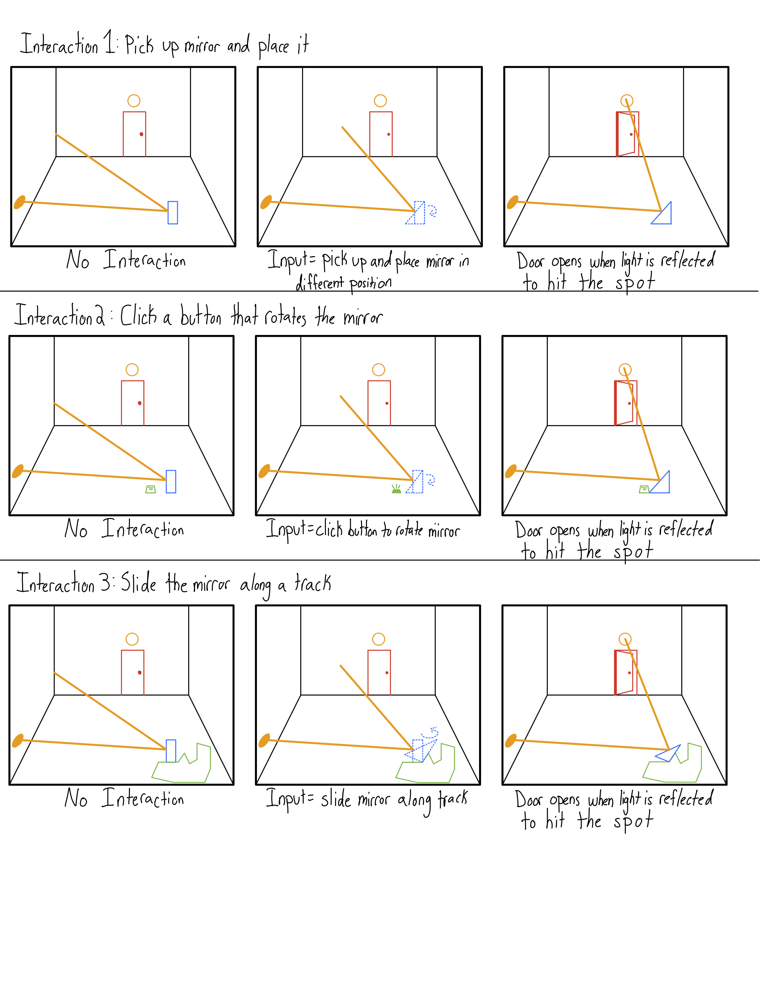

# VR Interaction Project
## Proposal
It is an interactive puzzle solved by changing rotating mirrors to make a light shine on specific spots.
- Ari Guzzi

### Interaction Description
The interaction will be changing the mirror's position in the space.

1) Pick up the mirror and place it in a different spot.
2) Click a button that rotates the mirror.
3) Slide the mirrors along a track by dragging them with the controller or swiping.

### Storyboards

## Final Deliverable
### Core Interactions I Implemented
I created three different ways to rotate a cube.
### Descriptions of Interactions I Implemented
- I made the blue cube rotate by having the user press X.
- I made the green cube rotate by holding it with the right trigger and tracking the controller's movement to spin it.
- I made the purple cube rotate by having the user pick it up by holding A and then pressing Y to rotate it.
### Observations and Reactions
I noticed a lot of my testers needed help with the picking-up interaction. I also realized that because I used so many different buttons, the user was not familiar with each button on the controller and couldn't see it with the goggles on. I also noticed that users usually took an extra second to get the green block to spin with controller movements.
### User Questions and Responses
#### Pre-Test Questions
1) Before we begin, tell me about your previous experience with virtual reality and how often you use VR applications. 
    a. At least twice a week 
    b. Not very often 
    c. Never outside of class 
    d. Not frequently, but I have been to a couple of VR arcades 
    e. Just class 

2) Have you used similar VR interactions before, such as rotating objects or using controllers for navigation? If yes, what types of interactions have you performed? 
    a. Used 3D modeling tools in VR 
    b. Yes, only one game - pressed the button on the controller to get into the rotate mode and used the joystick. 
    c. Yes, in a study 
    d. no 
    e. no 

3) What are your expectations from a VR application regarding ease of use and interaction? What makes a VR experience enjoyable for you? 
    a. You should always have controllers, and don't try to 100% copy reality 
    b. Having excellent movement, not nauseating, but fun. “Move in ways I can’t in actual real life” 
    c. Intuitive, when similar to real-life 
    d. Having feedback like vibrations or sound 
    e. intuitive, easy to figure out, immersive 

#### Post-Test Questions
1) How quickly were you able to understand and perform each interaction type? Did any methods feel slower or more cumbersome than the others? 
    a. When knowing which buttons are on the controller, nothing challenging 
    b. I liked purple the most, but it felt most difficult. Rotating one is weird, but I found it easier. Look at and tap the easiest 
    c. Green and blue were fast. Purple was hard  
    d. Relatively quickly, purple was harder 
    e. Green, blue, and purple felt easiest to hardest because the amount of buttons needed increased. 

2) Which interaction method gave you the most control over the cube's rotation? Did you feel any methods were too sensitive or not responsive enough? 
    a. Picking up was rotating in more axis than the others. I would prefer to use a joystick. The trigger rotating wish it was bsed on how much it was pushed down.  
    b. Rotate one was really sensitive. I liked the control of picking up the purple one. 
    c. The blue one. Purple is not responsive enough, and green is too sensitive 
    d. Green felt too sensitive. I like blue and purple. 
    e. I liked the purple one because it would reflect hand movement. Green felt too sensitive - and I wanted an amount of trigger for speed. 

3) If this were a puzzle game in which you rotated the pieces to solve the puzzle, which interaction would you recommend? 
    a. Liked purple, but recommends picking up with one hand and pass off to either hand 
    b. Purple, unless it's static, in which Blue 
    c. Blue 
    d. purple 
    e. Blue  
